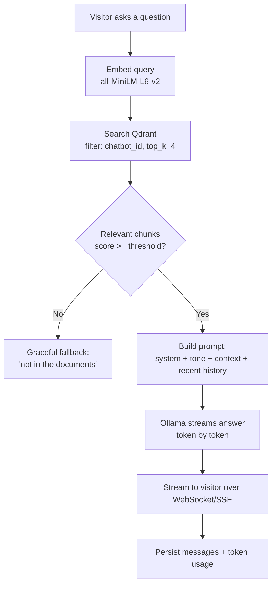
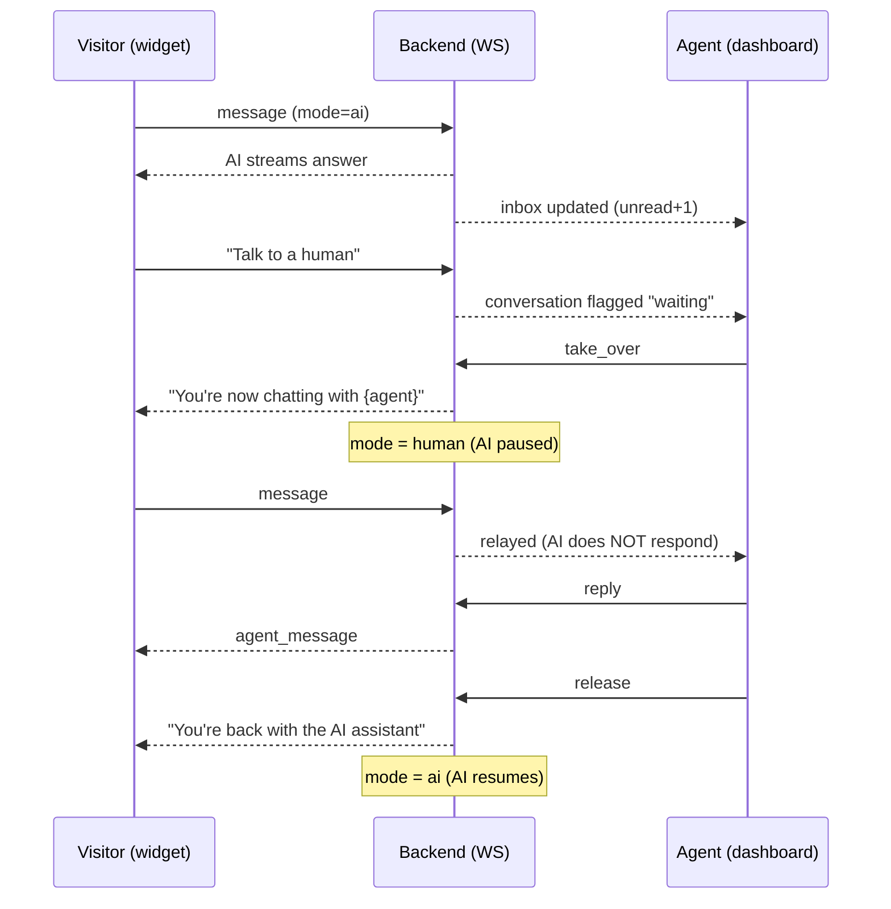
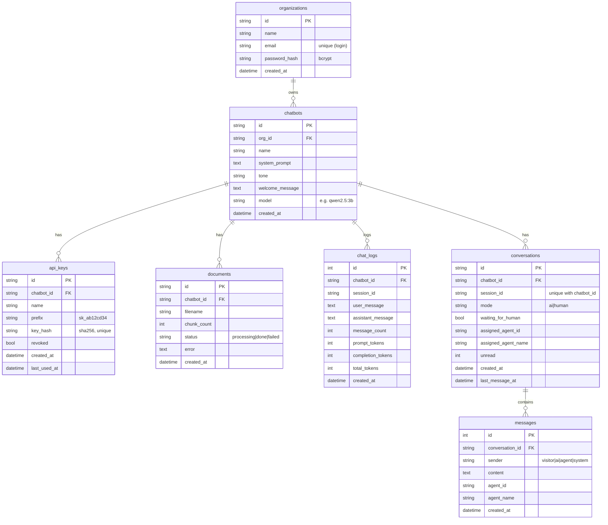

# RAG Console — Project Guide

A self-hosted, multi-tenant **RAG chatbot platform** with a management
dashboard, an embeddable chat widget, and **live human-agent handoff**.

This guide covers: what each piece does, how a question becomes an answer, how
takeover works, how to start everything, and the database design.

---

## 1. What it is (components)

| Component | Tech | Role |
|---|---|---|
| **Backend** | FastAPI (async, WebSockets) | API, RAG pipeline, auth, real-time messaging |
| **LLM** | Ollama (`qwen2.5:3b`) | generates answers (swappable via config) |
| **Embeddings** | sentence-transformers `all-MiniLM-L6-v2` | turns text into 384-dim vectors (local, free) |
| **Vector DB** | Qdrant | stores document chunk vectors, filtered per chatbot |
| **Relational DB** | PostgreSQL (SQLite for local dev) | orgs, chatbots, keys, docs, conversations, messages |
| **Dashboard** | React + Vite + TypeScript | manage chatbots/docs/keys, view usage, **Live Chats** |
| **Widget** | Vanilla TS core + React wrapper | embeddable chat bubble for any website |

### Two authentication planes
- **Organizations** log into the dashboard with email + password → **JWT**.
- **Chatbots** are called externally (widget, API) with a per-chatbot **API key**
  (`sk_…`), SHA-256 hashed in the DB (plaintext shown only once).

### Tenant isolation (strict)
Every Qdrant vector is tagged with `chatbot_id`; all search/ingest/delete filter
on it. An API key maps to exactly one chatbot; a JWT maps to one org. No chatbot
or org can ever read another's data.

---

## 2. How the chatbot answers a question (RAG flow)



**Ingestion** (how docs get searchable) runs once per upload:
`extract text (PDF/DOCX/TXT/MD) → chunk with overlap → embed → store in Qdrant`
with `chatbot_id` + `document_id` on every vector. Dashboard uploads run in the
background and show `processing → done | failed`.

---

## 3. How live human-agent handoff works

Each visitor session is a **Conversation** with a `mode`:

- `ai` (default) — the AI answers via RAG.
- `human` — a live agent answers; **the AI is paused**.



- Real-time transport: visitors use `WS /ws/chat/{session_id}` (auth: API key in
  query), agents use `WS /ws/agent` (auth: JWT in query).
- A **connection manager** (`app/services/ws_manager.py`) tracks sockets and
  broadcasts between a visitor and the agents of its org.
- **Collision guard**: if one agent already took a chat, another's take-over is
  rejected so two agents never reply at once.
- **Everything is persisted** to the `messages` table (visitor / ai / agent /
  system) so history is complete regardless of who answered.

> **Scaling note:** the connection manager holds sockets in process memory —
> correct for a single VPS / single uvicorn worker. For multiple workers, swap
> the in-process broadcast for **Redis pub/sub** (only the send/broadcast call
> sites change; persistence already lives in Postgres).

---

## 4. Database diagram

Relational schema (Postgres / SQLite). Vectors live separately in Qdrant.



**Outside Postgres — Qdrant collection `documents`:** one point per chunk,
`vector` (384-dim) + payload `{ chatbot_id, document_id, filename, chunk_index,
text }`. `chatbot_id` and `document_id` are indexed for fast tenant-scoped
filtering and deletes.

**Two history stores, on purpose:** `chat_logs` is turn-based analytics (token
usage, counts); `conversations`/`messages` is the full per-message transcript
(source of truth for the dashboard and handoff).

---

## 5. How to start the project

### Prerequisites (one time)
- **Python 3.11+**, **Node 18+**
- **Ollama** installed + model pulled:
  ```bash
  ollama pull qwen2.5:3b
  ```
- Python deps: `pip install -r requirements.txt`
- (Optional, for a public URL) **cloudflared**:
  `winget install Cloudflare.cloudflared`

### Start everything with one command

**Windows:**
```powershell
powershell -ExecutionPolicy Bypass -File .\start-all.ps1
```

**Linux / macOS:**
```bash
chmod +x start-all.sh && ./start-all.sh
```

This launches, each in its own window/process:

| Service | URL |
|---|---|
| Backend (API + `/docs`) | http://127.0.0.1:8000 |
| Dashboard | http://localhost:5173 |
| Widget demo | http://localhost:3000/demo/embed.html |
| Public tunnel | `https://<random>.trycloudflare.com` (printed on start) |

Flags: `-NoTunnel` (skip public URL), `-NoFrontend` (backend + widget only).
Bash: `NO_TUNNEL=1 ./start-all.sh`.

**Stop everything (Windows):**
```powershell
.\stop-all.ps1
```

### First run
1. Open the dashboard → **Sign up** (creates your org).
2. **New chatbot** → set name / system prompt / tone.
3. **Documents** → upload a PDF/DOCX/TXT/MD (wait for `done`).
4. **API Keys** → Generate → copy the key and the **embed snippet**.
5. **Test Chat** → ask something from your docs.
6. **Live Chats** → take over a conversation to chat as a human.

### Add the widget to another site
Paste the embed snippet (from API Keys) into any site:
```html
<script
  src="https://<your-backend-or-tunnel>/widget.js"
  data-api-url="https://<your-backend-or-tunnel>"
  data-api-key="sk_..."
  data-chatbot-id="..."
  data-title="Support"
  data-position="bottom-right"></script>
```
The backend serves `widget.js` itself, so no file copying is needed. For local
testing against other sites, use the cloudflared URL from `start-all`.

---

## 6. Project layout

```
chatbot/
├── app/                 FastAPI backend
│   ├── routers/         auth · manage · conversations · ws · ingest · chat · documents
│   ├── services/        rag · embeddings · vectorstore · llm · ingestion
│   │                    · auth · security · crud · ratelimit · ws_manager
│   └── db/              base (engine/session) · models (ORM)
├── alembic/             migrations (0001..0003)
├── frontend/            React dashboard (Vite + TS)
├── widget/              embeddable chat widget (npm lib + script embed)
├── docker-compose.yml   Postgres + Qdrant + Ollama + API (for the VPS)
├── start-all.ps1 / .sh  one-command local launcher
├── test_e2e.py          multi-tenant + isolation test
└── test_handoff.py      live human-agent handoff test
```

For production deployment (Docker on a VPS), see **README.md**.
